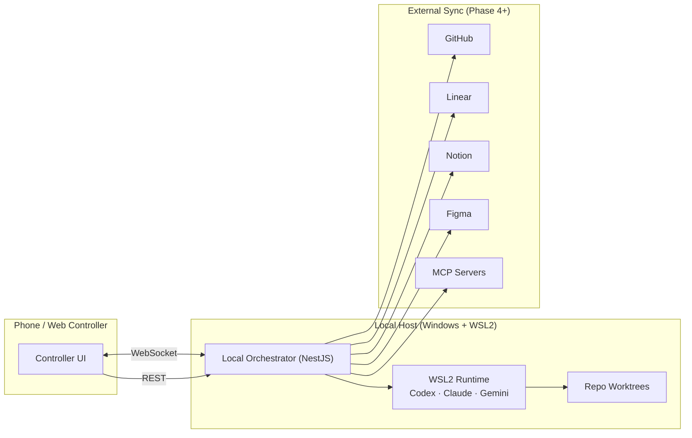

# Agents With Remote Control Mobile Controller

> Local-first agent orchestration: control CLI coding agents (Codex, Claude Code, Gemini) from your phone, with approval gates and Git worktree isolation.

**Status:** Phase 3 local implementation is in this working tree. The local orchestrator now builds on the Phase 2 controller loop with isolated Git worktrees, cooperative approval events, audit records, diff summaries, and configured test-run summaries. The approval model is containment-first and cooperative-gated; it does not claim universal pre-execution interception of every CLI action.

---

## TL;DR

Run AI coding agents on your PC. Control them from your phone. The agent works in an isolated Git worktree. When it needs to install something, mutate files, run a migration, commit, push, or do anything risky, it asks you on your phone. You approve, deny, or steer with free-text. Phase 3 stops at local review: diffs and configured tests are summarized, but commits, pushes, PRs, and external sync stay deferred.

## Current implementation scope

Phases 1 and 2 are complete. Phase 3 is the current local-loop hardening implementation. The code in this repo currently ships:

**Phase 1 — Local orchestrator**

- A root-level NestJS REST API.
- Prisma + SQLite persistence for `Task`, `AgentSession`, and `AgentLog`.
- A single `CodexAdapter` that launches `codex exec --json --cd <repoPath> -` through `node-pty`.
- REST endpoints: `POST /tasks`, `GET /tasks`, `GET /tasks/:id`, `POST /tasks/:id/stop`.
- Problem-details style JSON errors.

**Phase 2 — WebSocket gateway + controller UI**

- socket.io WebSocket gateway at the orchestrator root with `CONTROLLER_SECRET` bearer auth.
- Per-task rooms (`task:<id>`); the server emits `task.started`, `agent.log`, and `task.completed` as they happen.
- `POST /tasks/:id/input` REST endpoint that writes to the agent PTY stdin (requires the agent to support interactive input).
- Next.js 15 App Router controller UI in `controller/` (port 3001), proxied to the orchestrator via `next.config.ts` rewrites.
- Three pages: Dashboard (task list, 5s polling), New Task (prompt form), Task Detail (virtual log pane + live WebSocket updates, Continue/Stop actions).
- Sequence-based log deduplication so REST history and live WS stream don't produce duplicates.

**Phase 3 — Local-loop hardening**

- Per-task Git worktree provisioning under `ARC_WORKTREE_ROOT` (or a default sibling `worktrees/` directory).
- Task metadata for `worktreePath`, `branchName`, `baseRef`, `baseCommit`, and approval mode.
- Cooperative `ARC_ACTION_REQUEST` / `ARC_APPROVAL` protocol for typed approval requests where native CLI hooks are unavailable.
- `ApprovalRequest`, `AuditLog`, `GitChangeSummary`, and `TestRunSummary` persistence.
- Approval, policy-violation, diff, test, and worktree WebSocket events using a typed event envelope.
- Controller cards for pending approvals, diff summaries, and test run status.

Deferred until later phases:

- GitHub, Linear, Notion, Figma, MCP sync, and draft PR automation.
- Claude Code, Gemini, opencode, and multi-agent workflows (adapter pattern is documented in [`docs/adding-agents.md`](docs/adding-agents.md)).

See [`PLAN.md`](PLAN.md) for phase handoff contracts and manual smoke tests.

---

## Why this exists

CLI coding agents (Codex, Claude Code, Gemini) are powerful but they live tethered to a terminal session and to your physical presence at the keyboard. The moment you walk away — gym, errands, dinner — the agent stalls on the next approval prompt and waits idle.

This project gives those agents a remote command surface so the human-in-the-loop part can happen from your phone, while keeping the safety model strict by default.

It is **not** a mobile IDE. It is **not** a VS Code chat extension. It is a thin orchestrator + mobile/web controller around your existing CLI agents.

---

## Desired UX

1. Start or monitor an AI coding task from your phone.
2. The local orchestrator runs a CLI agent in WSL2.
3. The agent works inside an isolated repo worktree.
4. When the agent needs input, approval, or review, it pings your phone.
5. Reply with free text, structured actions, or approve/deny tool use, request tests, inspect summaries.
6. Continue, stop, inspect diff summaries, and run configured local tests from the phone.
7. Later, commit, open PRs, and sync work across GitHub, Linear, Figma, Notion, and MCP-backed tools.

---

## Architecture (high level)



Full architecture, lifecycle, approval-gate state machine, ERD, and alternatives considered: [`docs/diagrams.md`](docs/diagrams.md) and [`docs/ARCHITECTURE.md`](docs/ARCHITECTURE.md). FigJam companion diagrams are mirrored in [`docs/figma-companion-diagrams.md`](docs/figma-companion-diagrams.md).

---

## Phased plan

| Phase | Focus | Linear |
|---|---|---|
| **1** | Local orchestrator + single-agent CLI runner | [TSH-77](https://linear.app/michaelshuff/issue/TSH-77) |
| **2** | Mobile/web controller + live session UI | [TSH-78](https://linear.app/michaelshuff/issue/TSH-78) |
| **3** | Worktree isolation + approval gates + diffs + tests | [TSH-79](https://linear.app/michaelshuff/issue/TSH-79) |
| **4** | GitHub + Linear sync (issue → branch → commit → PR) | [TSH-80](https://linear.app/michaelshuff/issue/TSH-80) |
| **5** | Notion + Figma + controlled MCP expansion | [TSH-81](https://linear.app/michaelshuff/issue/TSH-81) |
| **6** | Multi-agent review + advanced automation | [TSH-82](https://linear.app/michaelshuff/issue/TSH-82) |

**First milestone:**
> _I can send a prompt to my local orchestrator, it launches Codex CLI in WSL2, captures logs, stores the session, and returns a summary._

---

## Tech stack (current intent)

**Backend (orchestrator)**

- Node.js + TypeScript
- NestJS
- Prisma + SQLite (MVP) → Postgres later if needed
- REST endpoints for one-shot commands
- `node-pty` for wrapping the Codex CLI
- WebSocket gateway for live updates in Phase 2
- Git worktree operations and cooperative approval gates in Phase 3

**Frontend (controller)**

- Next.js 15 (App Router), mobile-first, runs on port 3001
- Tailwind CSS for styling
- socket.io-client for live WS updates; `@tanstack/react-virtual` for virtualized log rendering
- PWA later
- Local LAN-only auth via `CONTROLLER_SECRET` header; harden later

**Runtime**

- Windows host
- WSL2 for agent execution
- Git worktrees for task isolation

## Phase 3 approval mode

Phase 3 uses a containment-first safety model:

- **Contain always:** every task runs in its own worktree and branch.
- **Intercept where real:** native CLI approval/sandbox hooks may be wired later if they expose reliable pre-execution semantics.
- **Cooperate where not:** Codex tasks can emit machine-readable `ARC_ACTION_REQUEST { ... }` lines; the orchestrator classifies them, stores an approval record, and responds with `ARC_APPROVAL { ... }` over stdin.
- **Review always:** diffs and configured test runs are summarized before any later commit/push/PR workflow. Phase 3 does not commit, push, open PRs, or sync external tools.

**Agents (adapter pattern)**

- Codex CLI (first target)
- Claude Code CLI (second)
- Gemini CLI (third)

**Integrations (later phases)**

- GitHub → first
- Linear → second
- Figma + Notion → after core loop works
- MCP servers → controlled tool layer, not core architecture

---

## Safety model

Three-tier classification on every requested action:

| Tier | Examples | Behavior |
| --- | --- | --- |
| **SAFE** | Read repo, inspect git, run tests, summarize, plan | Auto-allow, log only |
| **NEEDS APPROVAL** | Edit files, install, migrate, branch, commit, push, open PR, external sync, MCP write tools | Ping phone, wait for human |
| **BLOCKED BY DEFAULT** | Read `.env`/secrets, force push, prod deploy, modify auth, exfiltrate repo, modify global system config, run unknown shell scripts | Refuse outright, log event |

Every approval and denial is recorded in an audit log. Full taxonomy and rationale: [`docs/SAFETY.md`](docs/SAFETY.md).

---

## Communication transport

The orchestrator exposes both REST and WebSocket (socket.io) transports.

- **REST** — one-shot commands: create task, list tasks, inspect task, stop task, send input.
- **WebSocket** — live push for streaming log output and task lifecycle events (`task.started`, `agent.log`, `task.completed`). Clients authenticate by passing `CONTROLLER_SECRET` as the `auth.token` on the socket.io handshake. After connecting, clients join per-task rooms with `emit('subscribe', { taskId })`.

Long polling is intentionally avoided as a primary transport — it is client-initiated and not full-duplex.

---

## Non-goals (for now)

- Direct remote-control of VS Code chat panels (Copilot/Codex/Claude/Gemini extension UIs)
- A full mobile IDE
- Multi-agent orchestration before a single agent works end-to-end
- Auto-merge, auto-deploy, or unreviewed file deletion / force pushes / migrations / secret access

---

## Getting started

Prerequisites:

- Node.js 22+
- `pnpm`
- Local Codex CLI authentication already configured
- A Linux-side repo path for `ARC_REPO_PATH`

Install dependencies and generate Prisma:

```bash
pnpm install
pnpm prisma:generate
```

If `pnpm` is not available locally, this machine has been tested with:

```bash
npm exec --yes pnpm@10.18.3 -- install
npm exec --yes pnpm@10.18.3 -- prisma:generate
```

Create local config and initialize SQLite:

```bash
cp .env.example .env
pnpm prisma:migrate
```

Edit `.env` before running if `ARC_REPO_PATH` should point somewhere other than this checkout.
Set `ARC_WORKTREE_ROOT` when you want task worktrees somewhere specific; otherwise the orchestrator uses a sibling `worktrees/` directory beside `ARC_REPO_PATH`.
Set `ARC_TEST_COMMAND_TIMEOUT_MS` to bound configured test runs globally; individual `arc.config.json` test commands may override it with `timeoutMs`.
`ARC_CODEX_IGNORE_USER_CONFIG=true` is the recommended Phase 3 default. It adds `--ignore-user-config` to ARC-launched `codex exec` runs so user-configured MCP/OAuth/plugin side effects do not leak into local task logs; Codex auth still comes from `CODEX_HOME`.

Run the orchestrator:

```bash
pnpm start:dev
```

In a separate terminal, run the controller UI:

```bash
cd controller
pnpm install
pnpm dev          # http://localhost:3001
```

The controller proxies REST calls through its Next.js server so `CONTROLLER_SECRET` can stay server-side for HTTP actions. WebSocket auth still uses `NEXT_PUBLIC_CONTROLLER_SECRET` because the browser connects directly to the orchestrator socket.

The controller UI proxies API calls to the orchestrator at `http://127.0.0.1:3000`. Open `http://localhost:3001` in a browser (or on your phone via LAN IP) to start and monitor tasks.

You can also use the REST API directly:

```bash
# Start a task
curl -i -X POST http://127.0.0.1:3000/tasks \
  -H 'Content-Type: application/json' \
  -H 'X-Controller-Secret: <your-secret>' \
  -d '{"prompt":"Say hello from Codex and then stop.","agent":"codex","title":"Smoke test"}'

# Inspect it
curl -H 'X-Controller-Secret: <your-secret>' http://127.0.0.1:3000/tasks/<task-id>
```

### Accessing from your phone

**Same network (home/office WiFi):** set `ARC_HOST=0.0.0.0` and `ARC_ALLOW_PUBLIC_BIND=true` in `.env`, update `controller/.env.local` with your LAN IP, and open `http://<LAN-IP>:3001` on your phone.

**Outside your network (gym, travel):** see [`docs/remote-access.md`](docs/remote-access.md) for Tailscale, NetBird, Cloudflare Tunnel, and ngrok options. Tailscale is recommended for daily use — install once, works everywhere, no open ports.

More detail:

- [`docs/ARCHITECTURE.md`](docs/ARCHITECTURE.md) — full system design
- [`docs/SAFETY.md`](docs/SAFETY.md) — safety model and approval gates
- [`docs/remote-access.md`](docs/remote-access.md) — Tailscale, NetBird, Cloudflare Tunnel, ngrok
- [`docs/adding-agents.md`](docs/adding-agents.md) — how to add Claude Code, Gemini, opencode, or any custom CLI agent
- [`docs/diagrams.md`](docs/diagrams.md) — all 7 system diagrams
- [`docs/figma-companion-diagrams.md`](docs/figma-companion-diagrams.md) — Mermaid mirrors of the FigJam companion boards
- [`PLAN.md`](PLAN.md) — current phase contracts, Phase 3 handoff, and manual smoke tests
- [`arc.config.json`](arc.config.json) — Phase 3 policy and allowed local test commands
- [`AGENTS.md`](AGENTS.md) — instructions for AI agents working on this repo

---

## Project links

- **GitHub:** <https://github.com/mjshuff23/agents-with-remote-control-mobile-controller>
- **Linear project:** <https://linear.app/michaelshuff/project/agents-with-remote-control-mobile-controller-181d4f51202c>
- **Notion strategy doc:** <https://www.notion.so/35bc2ea5f18f8186b134efa7759a19e6>
- **Figma companion diagrams:** [`docs/figma-companion-diagrams.md`](docs/figma-companion-diagrams.md)

---

## License

[Apache 2.0](./LICENSE)
