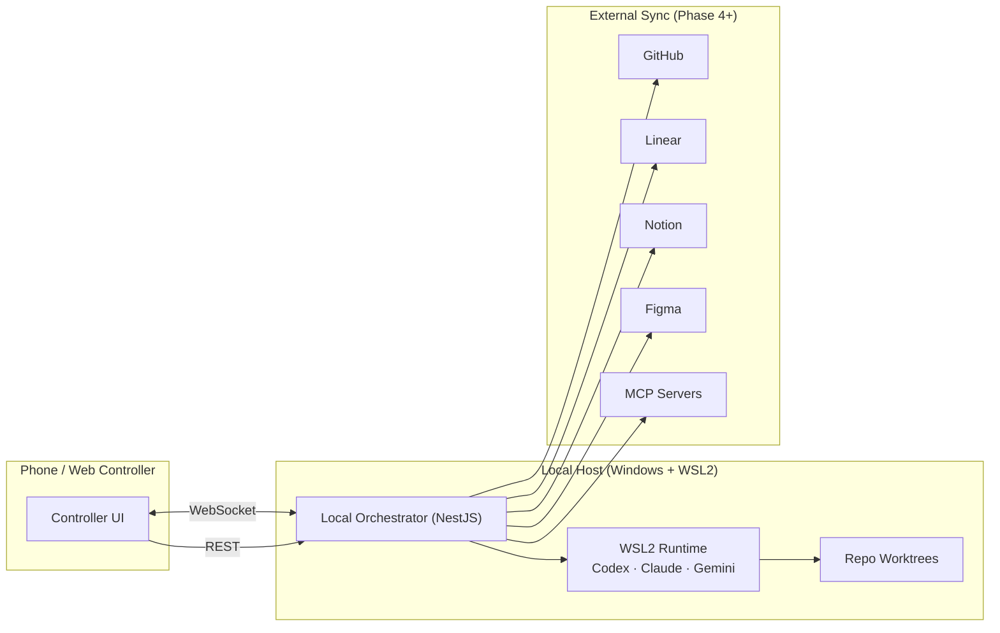

# Agents With Remote Control Mobile Controller

> Local-first agent orchestration: control CLI coding agents (Codex, Claude Code, Gemini) from your phone, with approval gates and Git worktree isolation.

**Status:** Pre-implementation. Strategy and project planning complete; Phase 1 implementation pending.

---

## TL;DR

Run AI coding agents on your PC. Control them from your phone. The agent works in an isolated Git worktree. When it needs to commit, push, install something, or do anything risky, it asks you on your phone. You approve, deny, or steer with free-text. When it's done, it opens a draft PR.

---

## Why this exists

CLI coding agents (Codex, Claude Code, Gemini) are powerful but they live tethered to a terminal session and to your physical presence at the keyboard. The moment you walk away — gym, errands, dinner — the agent stalls on the next approval prompt and waits idle.

This project gives those agents a remote command surface so the human-in-the-loop part can happen from your phone, while keeping the safety model strict by default.

It is **not** a mobile IDE. It is **not** a VS Code chat extension. It is a thin orchestrator + mobile/web controller around your existing CLI agents.

---

## Desired UX

1. Start or monitor an AI coding task from your phone.
2. The local orchestrator runs a CLI agent in WSL2.
3. The agent works inside an isolated repo worktree.
4. When the agent needs input, approval, or review, it pings your phone.
5. Reply with free text, structured actions, or approve/deny tool use, request tests, inspect summaries.
6. Continue, stop, commit, open PRs, or sync project tools — all from the phone.
7. Later, sync work across GitHub, Linear, Figma, Notion, and MCP-backed tools.

---

## Architecture (high level)

Full architecture, lifecycle, approval-gate state machine, ERD, and alternatives considered: [`docs/diagrams.md`](docs/diagrams.md) and [`docs/ARCHITECTURE.md`](docs/ARCHITECTURE.md).

---

## Phased plan

| Phase | Focus | Linear |
|---|---|---|
| **1** | Local orchestrator + single-agent CLI runner | [TSH-77](https://linear.app/michaelshuff/issue/TSH-77) |
| **2** | Mobile/web controller + live session UI | [TSH-78](https://linear.app/michaelshuff/issue/TSH-78) |
| **3** | Worktree isolation + approval gates + diffs + tests | [TSH-79](https://linear.app/michaelshuff/issue/TSH-79) |
| **4** | GitHub + Linear sync (issue → branch → commit → PR) | [TSH-80](https://linear.app/michaelshuff/issue/TSH-80) |
| **5** | Notion + Figma + controlled MCP expansion | [TSH-81](https://linear.app/michaelshuff/issue/TSH-81) |
| **6** | Multi-agent review + advanced automation | [TSH-82](https://linear.app/michaelshuff/issue/TSH-82) |

**First milestone:**
> _I can send a prompt to my local orchestrator, it launches Codex CLI in WSL2, captures logs, stores the session, and returns a summary._

---

## Tech stack (current intent)

**Backend (orchestrator)**
- Node.js + TypeScript
- NestJS
- SQLite (MVP) → Postgres later if needed
- WebSocket gateway for live updates
- REST endpoints for one-shot commands
- `node-pty` / `child_process` for wrapping CLI agents
- `simple-git` (or shelling to git) for worktree operations

**Frontend (controller)**
- Next.js (App Router) or React+Vite, mobile-first
- PWA later
- Local LAN-only auth to start; harden later

**Runtime**
- Windows host
- WSL2 for agent execution
- Git worktrees for task isolation

**Agents (adapter pattern)**
- Codex CLI (first target)
- Claude Code CLI (second)
- Gemini CLI (third)

**Integrations (later phases)**
- GitHub → first
- Linear → second
- Figma + Notion → after core loop works
- MCP servers → controlled tool layer, not core architecture

---

## Safety model

Three-tier classification on every requested action:

| Tier | Examples | Behavior |
|---|---|---|
| **SAFE** | Read repo, inspect git, run tests, summarize, plan | Auto-allow, log only |
| **NEEDS APPROVAL** | Edit files, install, migrate, branch, commit, push, open PR, external sync, MCP write tools | Ping phone, wait for human |
| **BLOCKED BY DEFAULT** | Read `.env`/secrets, force push, prod deploy, modify auth, exfiltrate repo, modify global system config, run unknown shell scripts | Refuse outright, log event |

Every approval and denial is recorded in an audit log. Full taxonomy and rationale: [`docs/SAFETY.md`](docs/SAFETY.md).

---

## Communication transport

**WebSockets** for bidirectional controller ↔ orchestrator updates. Long polling is client-initiated and not full duplex, so it's intentionally avoided as the primary architecture. REST handles one-shot commands.

---

## Non-goals (for now)

- Direct remote-control of VS Code chat panels (Copilot/Codex/Claude/Gemini extension UIs)
- A full mobile IDE
- Multi-agent orchestration before a single agent works end-to-end
- Auto-merge, auto-deploy, or unreviewed file deletion / force pushes / migrations / secret access

---

## Getting started

> Phase 1 implementation has not landed yet. Once it does, this section will document WSL2 + Node.js + Codex CLI setup and the first prompt walkthrough.

For now, see:
- [`docs/ARCHITECTURE.md`](docs/ARCHITECTURE.md) — full system design
- [`docs/SAFETY.md`](docs/SAFETY.md) — safety model and approval gates
- [`docs/diagrams.md`](docs/diagrams.md) — all 7 system diagrams
- [`AGENTS.md`](AGENTS.md) — instructions for AI agents working on this repo

---

## Project links

- **GitHub:** https://github.com/mjshuff23/agents-with-remote-control-mobile-controller
- **Linear project:** https://linear.app/michaelshuff/project/agents-with-remote-control-mobile-controller-181d4f51202c
- **Notion strategy doc:** https://www.notion.so/35bc2ea5f18f8186b134efa7759a19e6
- **Figma diagrams:** _deferred until seat upgrade — Mermaid versions live in `docs/diagrams.md`_

---

## License

[Apache 2.0](./LICENSE)
