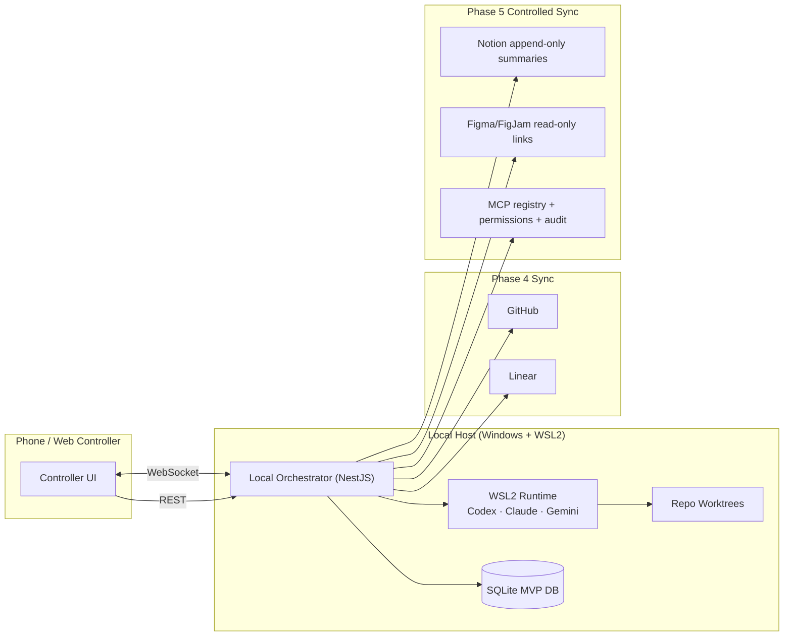

# Agents With Remote Control Mobile Controller

> Local-first agent orchestration: control CLI coding agents (Codex, Claude Code, Gemini) from your phone, with approval gates, Git worktree isolation, durable reconnect/replay, human-approved GitHub/Linear sync, and now Phase 5 controlled MCP / Notion / Figma synchronization.

**Status:** Phases 1, 2, 3, 3.5, 4, and 4.5 are complete. **Phase 5 is active:** Notion, Figma/FigJam, and controlled MCP synchronization behind explicit permissions, mobile approval gates, and audit logging.

---

## TL;DR

Run AI coding agents on your PC. Control them from your phone. The agent works in an isolated Git worktree. Risky actions are surfaced as approval cards. Phase 3 made local coding work safe enough to review; Phase 3.5 made long-lived mobile sessions durable enough to reconnect, replay missed events, checkpoint, and restore dormant sessions.

Phase 4 connects that local loop to GitHub and Linear while preserving the human approval gate. Phase 4.5 established Tailscale as the default private remote-access path for phone approvals outside the home LAN. Phase 5 now adds Notion strategy-doc sync, Figma/FigJam link metadata, and a controlled MCP tool layer with explicit permissions and audit trails.

## Current implementation scope

**Phase 1 — Local orchestrator**

- Root-level NestJS REST API.
- Prisma + SQLite persistence for `Task`, `AgentSession`, and `AgentLog`.
- `CodexAdapter` that launches `codex exec --json --cd <repoPath> -` through `node-pty` and resumes idle turns with `codex exec resume --json <thread_id> -`.
- REST endpoints: `POST /tasks`, `GET /tasks`, `GET /tasks/:id`, `POST /tasks/:id/stop`.
- Real Codex PTY smoke path and token-gated integration e2e tier.

**Phase 2 — WebSocket gateway + controller UI**

- Socket.IO WebSocket gateway with `CONTROLLER_SECRET` bearer auth.
- Per-task rooms (`task:<id>`) and live task/log events.
- `POST /tasks/:id/input` for follow-up instructions.
- Next.js App Router controller UI in `controller/`.
- Dashboard, New Task, and Task Detail pages.
- Sequence-based log deduplication.

**Phase 3 — Local-loop hardening**

- Per-task Git worktree provisioning.
- Task metadata for `worktreePath`, `branchName`, `baseRef`, `baseCommit`, and approval mode.
- Cooperative `ARC_ACTION_REQUEST` / `ARC_APPROVAL` protocol.
- `ApprovalRequest`, `AuditLog`, `GitChangeSummary`, and `TestRunSummary` persistence.
- Controller cards for pending approvals, diff summaries, and test status.
- Three-tier safety model: SAFE, NEEDS_APPROVAL, BLOCKED.

**Phase 3.5 — Continuous Agent stabilization**

- Durable task-scoped event ledger with replay cursors.
- Mobile reconnect/resubscribe behavior.
- Checkpoint and dormant-session lifecycle.
- Explicit distinction between live PTY processes, idle Codex thread resume, and reconstructed DB view.
- Feature/provider seams prepared for GitHub, Linear, Notion, Figma, and MCP.
- Dependency/package hygiene and docs linting improvements.

**Phase 4 — GitHub + Linear sync**

- GitHub issue and Linear issue linking at task creation.
- Provider adapter seams for GitHub and Linear.
- `SyncEvent` idempotency model.
- Branch/worktree lifecycle tied to external issue metadata.
- Approval-gated commit, push, and draft PR creation.
- Linear ↔ GitHub cross-reference sync.
- PR merge detection and Linear completion sync.
- Mobile sync UI, provider error surfaces, and token-gated provider e2e tests.

**Phase 4.5 — Tailscale remote-access baseline**

- Tailscale remote access baseline for daily phone use outside the home LAN.
- `ARC_HOST=0.0.0.0` and `ARC_ALLOW_PUBLIC_BIND=true` only behind a trusted private overlay.
- Controller remote config for browser WebSocket access and server-side REST proxying.
- Windows/WSL2 networking notes for direct access, mirrored networking, or scoped port proxy.
- Mobile smoke coverage for task list, task detail, replay, and approval cards.

See [`docs/remote-access.md`](docs/remote-access.md) for the default daily remote-access setup.

**Phase 5 — Active controlled sync expansion**

- Notion strategy doc sync through append-only session summaries.
- Figma/FigJam URL parsing, read-only metadata, and task/issue link attachments.
- MCP server registry with declared tools, transports, and permission ceilings.
- Transport abstractions for stdio, Streamable HTTP, and legacy SSE compatibility.
- Permission ladder: `read_only`, `append_only`, `write`, and admin blocked/reserved.
- Mobile approval required for append/write-capable MCP/provider calls.
- MCP audit log with sanitized previews plus argument/result hashes.
- Controller surfaces for registry state, pending MCP approvals, audit events, and provider sync status.
- Repo-local official source snapshot and PR contract for implementation-agent token efficiency.

Phase 5 implementation docs:

- [`docs/phase-5-implementation.md`](docs/phase-5-implementation.md)
- [`docs/mcp-controlled-sync.md`](docs/mcp-controlled-sync.md)
- [`docs/phase-5-official-sources.md`](docs/phase-5-official-sources.md)
- [`.github/PULL_REQUEST_TEMPLATE.md`](.github/PULL_REQUEST_TEMPLATE.md)

Deferred until later phases:

- Multi-agent review and advanced automation (Phase 6).
- Auto-merge, auto-deploy, or unattended production actions (not currently planned).
- Figma writes, Notion page replacement/deletion, destructive/admin MCP tools.

---

## Why this exists

CLI coding agents are powerful but tethered to terminal sessions and keyboard presence. The moment you walk away — gym, errands, dinner — the agent stalls on the next approval prompt.

This project gives agents a remote command surface so the human-in-the-loop part can happen from your phone, while keeping the safety model strict by default.

It is **not** a mobile IDE. It is **not** a VS Code chat extension. It is a thin orchestrator + mobile/web controller around existing CLI agents.

---

## Desired UX

1. Start or monitor an AI coding task from your phone.
2. The local orchestrator runs a CLI agent in WSL2.
3. The agent works inside an isolated repo worktree.
4. When the agent needs input, approval, or review, it pings your phone.
5. Reply with free text, structured actions, or approve/deny tool use.
6. Inspect diff summaries, run configured local tests, and restore/replay long-lived sessions.
7. Link a task to GitHub/Linear, approve commit/push/PR actions, and sync project state without leaving the phone.
8. Use Tailscale so approvals keep working from cellular or non-home WiFi.
9. In Phase 5, approve controlled Notion/Figma/MCP sync actions with explicit context and auditability.

---

## Architecture (high level)



Full architecture, lifecycle, approval-gate state machine, ERD, and alternatives considered: [`docs/diagrams.md`](docs/diagrams.md) and [`docs/ARCHITECTURE.md`](docs/ARCHITECTURE.md). FigJam companion diagrams are mirrored in [`docs/figma-companion-diagrams.md`](docs/figma-companion-diagrams.md).

---

## Phased plan

| Phase | Focus | Linear | GitHub |
| --- | --- | --- | --- |
| **1** | Local orchestrator + single-agent CLI runner | [TSH-77](https://linear.app/michaelshuff/issue/TSH-77) | [#2](https://github.com/mjshuff23/agents-with-remote-control-mobile-controller/issues/2) |
| **2** | Mobile/web controller + live session UI | [TSH-78](https://linear.app/michaelshuff/issue/TSH-78) | [#3](https://github.com/mjshuff23/agents-with-remote-control-mobile-controller/issues/3) |
| **3** | Worktree isolation + approval gates + diffs + tests | [TSH-79](https://linear.app/michaelshuff/issue/TSH-79) | [#4](https://github.com/mjshuff23/agents-with-remote-control-mobile-controller/issues/4) |
| **3.5** | Continuous-agent stabilization, reconnect, checkpointing, package hygiene | [TSH-83](https://linear.app/michaelshuff/issue/TSH-83) | PRs #18, #21, #22, #23 |
| **4** | GitHub + Linear sync (issue → branch → commit → PR) | [TSH-80](https://linear.app/michaelshuff/issue/TSH-80) | [#5](https://github.com/mjshuff23/agents-with-remote-control-mobile-controller/issues/5) |
| **4.5** | Tailscale private remote-access baseline | [TSH-111](https://linear.app/michaelshuff/issue/TSH-111) | [#43](https://github.com/mjshuff23/agents-with-remote-control-mobile-controller/issues/43) |
| **5** | Notion + Figma + controlled MCP expansion | [TSH-81](https://linear.app/michaelshuff/issue/TSH-81) | [#6](https://github.com/mjshuff23/agents-with-remote-control-mobile-controller/issues/6) |
| **6** | Multi-agent review + advanced automation | [TSH-82](https://linear.app/michaelshuff/issue/TSH-82) | [#7](https://github.com/mjshuff23/agents-with-remote-control-mobile-controller/issues/7) |

---

## Phase 5 ticket map

| Linear | Focus |
| --- | --- |
| [TSH-112](https://linear.app/michaelshuff/issue/TSH-112) | MCP registry schema and config loader |
| [TSH-113](https://linear.app/michaelshuff/issue/TSH-113) | MCP transport abstractions for stdio, Streamable HTTP, and legacy SSE |
| [TSH-114](https://linear.app/michaelshuff/issue/TSH-114) | MCP permission ladder and non-escalation rules |
| [TSH-115](https://linear.app/michaelshuff/issue/TSH-115) | Mobile approval cards for write-capable MCP calls |
| [TSH-116](https://linear.app/michaelshuff/issue/TSH-116) | MCP audit log model with argument/result hashing |
| [TSH-117](https://linear.app/michaelshuff/issue/TSH-117) | Notion adapter for project-doc reads and append-only session summaries |
| [TSH-118](https://linear.app/michaelshuff/issue/TSH-118) | Figma/FigJam adapter for read-only metadata and task link attachments |
| [TSH-119](https://linear.app/michaelshuff/issue/TSH-119) | Controller surfaces for MCP registry, tool-call audit, and provider sync status |
| [TSH-120](https://linear.app/michaelshuff/issue/TSH-120) | Phase 5 provider/MCP test matrix, docs bundle, and PR contract |

Recommended order: registry → transports → permission ladder → mobile approvals → audit log → Notion → Figma → controller surfaces → docs/test contract hardening.

---

## Tech stack

**Backend (orchestrator)**

- Node.js + TypeScript
- NestJS
- Prisma + SQLite (MVP)
- REST endpoints for one-shot commands
- Socket.IO for live updates
- `node-pty` for wrapping CLI agents
- Git worktree operations and cooperative approval gates
- Provider seams for GitHub/Linear in Phase 4
- Controlled MCP, Notion, and Figma/FigJam seams in Phase 5

**Frontend (controller)**

- Next.js App Router, mobile-first, runs on port 3001
- Tailwind CSS
- socket.io-client
- virtualized log rendering
- local/private-overlay auth via `CONTROLLER_SECRET`

**Runtime**

- Windows host
- WSL2 for agent execution
- Git worktrees for task isolation
- Tailscale private overlay for default daily phone access outside the home LAN

---

## Safety model

Three-tier classification on every requested action:

| Tier | Examples | Behavior |
| --- | --- | --- |
| **SAFE** | Read repo, inspect git, run tests, summarize, plan | Auto-allow, log only |
| **NEEDS APPROVAL** | Edit files, install, migrate, branch, commit, push, open PR, external sync, MCP append/write tools | Ping phone, wait for human |
| **BLOCKED BY DEFAULT** | Read `.env`/secrets, force push, prod deploy, modify auth, exfiltrate repo, destructive/admin MCP tools, modify global system config, run unknown shell scripts | Refuse outright, log event |

Every approval and denial is recorded in an audit log. Full taxonomy and rationale: [`docs/SAFETY.md`](docs/SAFETY.md).

---

## Getting started

Prerequisites:

- Node.js 22+
- `pnpm`
- Local Codex CLI authentication already configured
- A Linux-side repo path for `ARC_REPO_PATH`

Install dependencies and generate Prisma:

```bash
pnpm install
pnpm prisma:generate
```

Create local config and initialize SQLite:

```bash
cp .env.example .env
pnpm prisma:migrate
```

Run the orchestrator:

```bash
pnpm start:dev
```

In a separate terminal, run the controller UI:

```bash
cd controller
pnpm install
pnpm dev          # http://localhost:3001
```

The controller proxies REST calls through its Next.js server so `CONTROLLER_SECRET` can stay server-side for HTTP actions. WebSocket auth still uses `NEXT_PUBLIC_CONTROLLER_SECRET` because the browser connects directly to the orchestrator socket.

### Accessing from your phone

**Same network:** set `ARC_HOST=0.0.0.0` and `ARC_ALLOW_PUBLIC_BIND=true` in `.env`, update `controller/.env.local` with your LAN IP, and open `http://<LAN-IP>:3001` on your phone.

**Outside your network:** use the Tailscale setup in [`docs/remote-access.md`](docs/remote-access.md). This is the default daily setup for Phase 5 approvals and controlled external sync.

---

## Phase 5 PR gates

Every Phase 5 implementation PR must include exact commands run and results:

```bash
pnpm install
pnpm audit --audit-level=low
pnpm typecheck
pnpm test
pnpm test:e2e
pnpm lint:md
pnpm --filter controller typecheck
pnpm --filter controller build
```

See [`.github/PULL_REQUEST_TEMPLATE.md`](.github/PULL_REQUEST_TEMPLATE.md) for the full PR contract.

---

## Project links

- **GitHub:** <https://github.com/mjshuff23/agents-with-remote-control-mobile-controller>
- **Linear project:** <https://linear.app/michaelshuff/project/agents-with-remote-control-mobile-controller-181d4f51202c>
- **Notion strategy doc:** <https://www.notion.so/35bc2ea5f18f8186b134efa7759a19e6>
- **Phase 4 handoff:** [`docs/phase-4-implementation.md`](docs/phase-4-implementation.md)
- **Remote access:** [`docs/remote-access.md`](docs/remote-access.md)
- **Phase 5 blueprint:** [`docs/phase-5-implementation.md`](docs/phase-5-implementation.md)
- **Controlled MCP sync:** [`docs/mcp-controlled-sync.md`](docs/mcp-controlled-sync.md)

---

## License

[Apache 2.0](./LICENSE)
