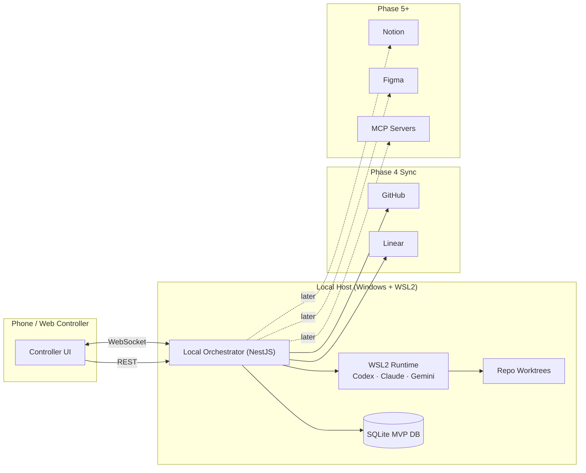

# Agents With Remote Control Mobile Controller

> Local-first agent orchestration: control CLI coding agents (Codex, Claude Code, Gemini) from your phone, with approval gates, Git worktree isolation, durable reconnect/replay, and human-approved GitHub/Linear sync.

**Status:** Phases 1, 2, 3, and 3.5 are complete. Phase 4 is the active implementation frontier: GitHub + Linear synchronization for the issue → branch → approved commit → approved push → draft PR → Linear status/link workflow.

---

## TL;DR

Run AI coding agents on your PC. Control them from your phone. The agent works in an isolated Git worktree. Risky actions are surfaced as approval cards. Phase 3 made local coding work safe enough to review; Phase 3.5 made long-lived mobile sessions durable enough to reconnect, replay missed events, checkpoint, and restore dormant sessions.

Phase 4 now connects that local loop to GitHub and Linear while preserving the human approval gate. The system should help create branches, commits, pushes, draft PRs, and Linear sync events, but it must not auto-merge, auto-deploy, force-push, or perform provider writes without explicit approval.

## Current implementation scope

**Phase 1 — Local orchestrator**

- Root-level NestJS REST API.
- Prisma + SQLite persistence for `Task`, `AgentSession`, and `AgentLog`.
- `CodexAdapter` that launches `codex exec --json --cd <repoPath> -` through `node-pty`.
- REST endpoints: `POST /tasks`, `GET /tasks`, `GET /tasks/:id`, `POST /tasks/:id/stop`.
- Real Codex PTY smoke path and token-gated integration e2e tier.

**Phase 2 — WebSocket gateway + controller UI**

- Socket.IO WebSocket gateway with `CONTROLLER_SECRET` bearer auth.
- Per-task rooms (`task:<id>`) and live task/log events.
- `POST /tasks/:id/input` for follow-up instructions.
- Next.js App Router controller UI in `controller/`.
- Dashboard, New Task, and Task Detail pages.
- Sequence-based log deduplication.

**Phase 3 — Local-loop hardening**

- Per-task Git worktree provisioning.
- Task metadata for `worktreePath`, `branchName`, `baseRef`, `baseCommit`, and approval mode.
- Cooperative `ARC_ACTION_REQUEST` / `ARC_APPROVAL` protocol.
- `ApprovalRequest`, `AuditLog`, `GitChangeSummary`, and `TestRunSummary` persistence.
- Controller cards for pending approvals, diff summaries, and test status.
- Three-tier safety model: SAFE, NEEDS_APPROVAL, BLOCKED.

**Phase 3.5 — Continuous Agent stabilization**

- Durable task-scoped event ledger with replay cursors.
- Mobile reconnect/resubscribe behavior.
- Checkpoint and dormant-session lifecycle.
- Explicit distinction between live PTY resume and reconstructed DB view.
- Feature/provider seams prepared for GitHub, Linear, Notion, Figma, and MCP.
- Dependency/package hygiene and docs linting improvements.

**Phase 4 — Active frontier**

- GitHub issue and Linear issue linking at task creation.
- Provider adapter seams for GitHub and Linear.
- `SyncEvent` idempotency model.
- Branch/worktree lifecycle tied to external issue metadata.
- Approval-gated commit, push, and draft PR creation.
- Linear ↔ GitHub cross-reference sync.
- PR merge detection and Linear completion sync.
- Mobile sync UI, provider error surfaces, and token-gated provider e2e tests.

See [`docs/phase-4-implementation.md`](docs/phase-4-implementation.md) for the current Phase 4 handoff.

Deferred until later phases:

- Notion/Figma/MCP writes and controlled tool registry (Phase 5).
- Multi-agent review and advanced automation (Phase 6).
- Auto-merge, auto-deploy, or unattended production actions (not currently planned).

---

## Why this exists

CLI coding agents are powerful but tethered to terminal sessions and keyboard presence. The moment you walk away — gym, errands, dinner — the agent stalls on the next approval prompt.

This project gives agents a remote command surface so the human-in-the-loop part can happen from your phone, while keeping the safety model strict by default.

It is **not** a mobile IDE. It is **not** a VS Code chat extension. It is a thin orchestrator + mobile/web controller around existing CLI agents.

---

## Desired UX

1. Start or monitor an AI coding task from your phone.
2. The local orchestrator runs a CLI agent in WSL2.
3. The agent works inside an isolated repo worktree.
4. When the agent needs input, approval, or review, it pings your phone.
5. Reply with free text, structured actions, or approve/deny tool use.
6. Inspect diff summaries, run configured local tests, and restore/replay long-lived sessions.
7. In Phase 4, link a task to GitHub/Linear, approve commit/push/PR actions, and sync project state without leaving the phone.

---

## Architecture (high level)



Full architecture, lifecycle, approval-gate state machine, ERD, and alternatives considered: [`docs/diagrams.md`](docs/diagrams.md) and [`docs/ARCHITECTURE.md`](docs/ARCHITECTURE.md). FigJam companion diagrams are mirrored in [`docs/figma-companion-diagrams.md`](docs/figma-companion-diagrams.md).

---

## Phased plan

| Phase | Focus | Linear | GitHub |
|---|---|---|---|
| **1** | Local orchestrator + single-agent CLI runner | [TSH-77](https://linear.app/michaelshuff/issue/TSH-77) | [#2](https://github.com/mjshuff23/agents-with-remote-control-mobile-controller/issues/2) |
| **2** | Mobile/web controller + live session UI | [TSH-78](https://linear.app/michaelshuff/issue/TSH-78) | [#3](https://github.com/mjshuff23/agents-with-remote-control-mobile-controller/issues/3) |
| **3** | Worktree isolation + approval gates + diffs + tests | [TSH-79](https://linear.app/michaelshuff/issue/TSH-79) | [#4](https://github.com/mjshuff23/agents-with-remote-control-mobile-controller/issues/4) |
| **3.5** | Continuous-agent stabilization, reconnect, checkpointing, package hygiene | [TSH-83](https://linear.app/michaelshuff/issue/TSH-83) | PRs #18, #21, #22, #23 |
| **4** | GitHub + Linear sync (issue → branch → commit → PR) | [TSH-80](https://linear.app/michaelshuff/issue/TSH-80) | [#5](https://github.com/mjshuff23/agents-with-remote-control-mobile-controller/issues/5) |
| **5** | Notion + Figma + controlled MCP expansion | [TSH-81](https://linear.app/michaelshuff/issue/TSH-81) | [#6](https://github.com/mjshuff23/agents-with-remote-control-mobile-controller/issues/6) |
| **6** | Multi-agent review + advanced automation | [TSH-82](https://linear.app/michaelshuff/issue/TSH-82) | [#7](https://github.com/mjshuff23/agents-with-remote-control-mobile-controller/issues/7) |

---

## Phase 4 ticket map

| Linear | Focus |
|---|---|
| [TSH-97](https://linear.app/michaelshuff/issue/TSH-97) | GitHub access model |
| [TSH-98](https://linear.app/michaelshuff/issue/TSH-98) | Linear access model + status mapping |
| [TSH-99](https://linear.app/michaelshuff/issue/TSH-99) | SyncEvent idempotency |
| [TSH-100](https://linear.app/michaelshuff/issue/TSH-100) | Issue picker + task linking UX |
| [TSH-101](https://linear.app/michaelshuff/issue/TSH-101) | Branch naming + worktree lifecycle |
| [TSH-102](https://linear.app/michaelshuff/issue/TSH-102) | Approved commit flow + signing checks |
| [TSH-103](https://linear.app/michaelshuff/issue/TSH-103) | Approved push flow + remote protection |
| [TSH-104](https://linear.app/michaelshuff/issue/TSH-104) | Draft PR creation + generated summary |
| [TSH-105](https://linear.app/michaelshuff/issue/TSH-105) | Linear-GitHub cross-reference sync |
| [TSH-106](https://linear.app/michaelshuff/issue/TSH-106) | PR merge detection + Linear completion sync |
| [TSH-107](https://linear.app/michaelshuff/issue/TSH-107) | Provider adapter seams |
| [TSH-108](https://linear.app/michaelshuff/issue/TSH-108) | Approval/audit/sync integration |
| [TSH-109](https://linear.app/michaelshuff/issue/TSH-109) | Mobile sync UI + provider errors |
| [TSH-110](https://linear.app/michaelshuff/issue/TSH-110) | Provider test matrix + token-gated e2e |

---

## Tech stack

**Backend (orchestrator)**

- Node.js + TypeScript
- NestJS
- Prisma + SQLite (MVP)
- REST endpoints for one-shot commands
- Socket.IO for live updates
- `node-pty` for wrapping CLI agents
- Git worktree operations and cooperative approval gates
- Provider seams for GitHub/Linear in Phase 4

**Frontend (controller)**

- Next.js App Router, mobile-first, runs on port 3001
- Tailwind CSS
- socket.io-client
- virtualized log rendering
- local LAN auth via `CONTROLLER_SECRET`

**Runtime**

- Windows host
- WSL2 for agent execution
- Git worktrees for task isolation

---

## Safety model

Three-tier classification on every requested action:

| Tier | Examples | Behavior |
| --- | --- | --- |
| **SAFE** | Read repo, inspect git, run tests, summarize, plan | Auto-allow, log only |
| **NEEDS APPROVAL** | Edit files, install, migrate, branch, commit, push, open PR, external sync, MCP write tools | Ping phone, wait for human |
| **BLOCKED BY DEFAULT** | Read `.env`/secrets, force push, prod deploy, modify auth, exfiltrate repo, modify global system config, run unknown shell scripts | Refuse outright, log event |

Every approval and denial is recorded in an audit log. Full taxonomy and rationale: [`docs/SAFETY.md`](docs/SAFETY.md).

---

## Getting started

Prerequisites:

- Node.js 22+
- `pnpm`
- Local Codex CLI authentication already configured
- A Linux-side repo path for `ARC_REPO_PATH`

Install dependencies and generate Prisma:

```bash
pnpm install
pnpm prisma:generate
```

Create local config and initialize SQLite:

```bash
cp .env.example .env
pnpm prisma:migrate
```

Run the orchestrator:

```bash
pnpm start:dev
```

In a separate terminal, run the controller UI:

```bash
cd controller
pnpm install
pnpm dev          # http://localhost:3001
```

The controller proxies REST calls through its Next.js server so `CONTROLLER_SECRET` can stay server-side for HTTP actions. WebSocket auth still uses `NEXT_PUBLIC_CONTROLLER_SECRET` because the browser connects directly to the orchestrator socket.

### Accessing from your phone

**Same network:** set `ARC_HOST=0.0.0.0` and `ARC_ALLOW_PUBLIC_BIND=true` in `.env`, update `controller/.env.local` with your LAN IP, and open `http://<LAN-IP>:3001` on your phone.

**Outside your network:** see [`docs/remote-access.md`](docs/remote-access.md). Tailscale is recommended for daily use.

---

## Project links

- **GitHub:** <https://github.com/mjshuff23/agents-with-remote-control-mobile-controller>
- **Linear project:** <https://linear.app/michaelshuff/project/agents-with-remote-control-mobile-controller-181d4f51202c>
- **Notion strategy doc:** <https://www.notion.so/35bc2ea5f18f8186b134efa7759a19e6>
- **Phase 4 handoff:** [`docs/phase-4-implementation.md`](docs/phase-4-implementation.md)

---

## License

[Apache 2.0](./LICENSE)
