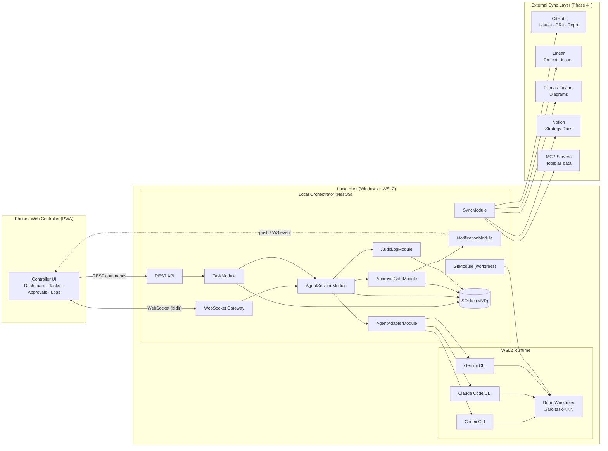
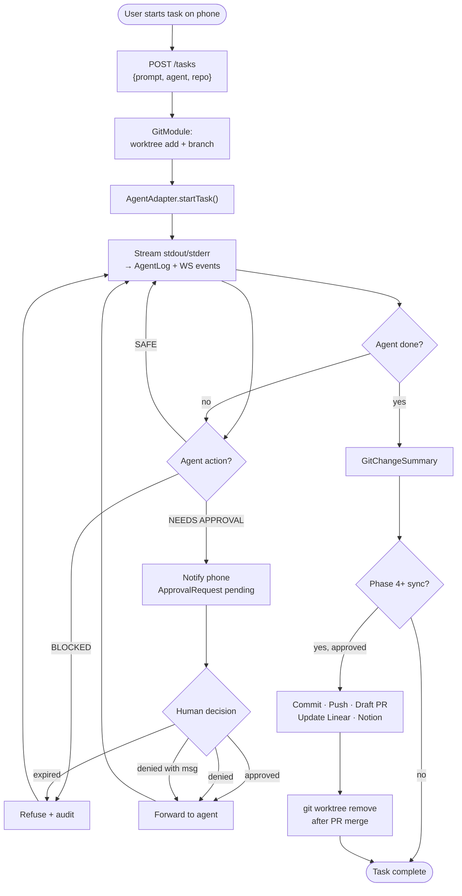
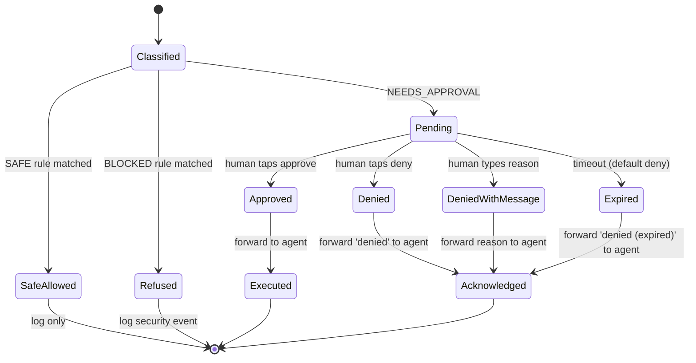
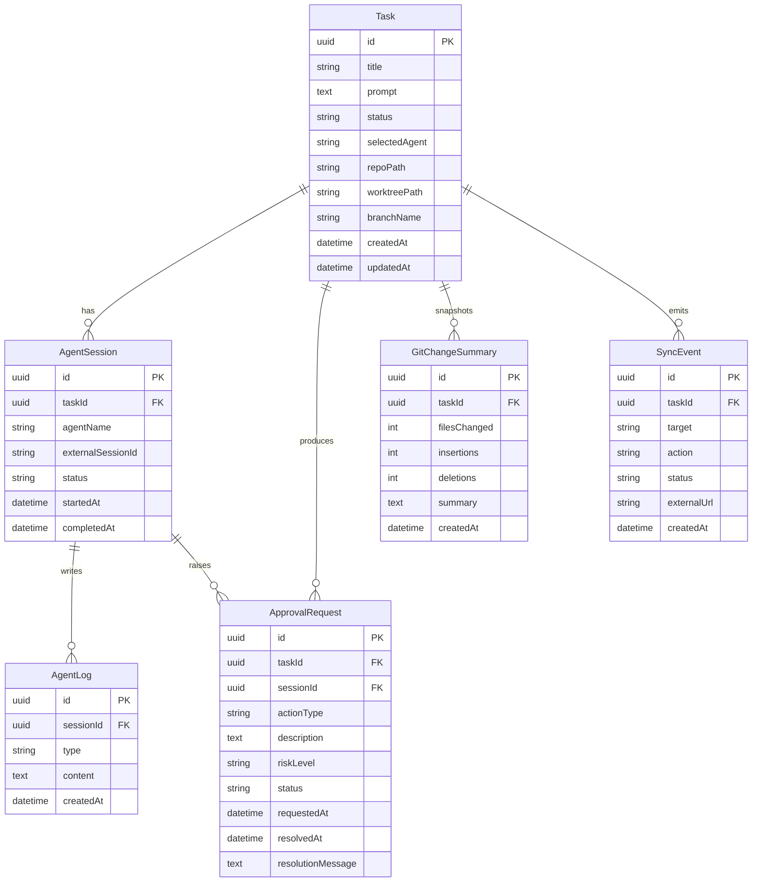
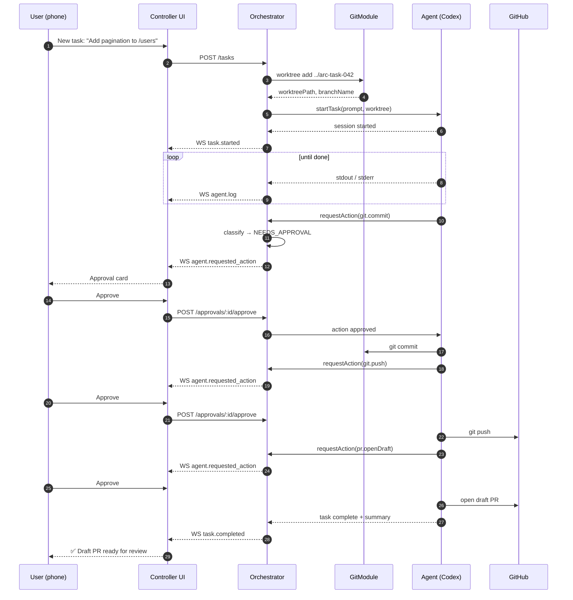
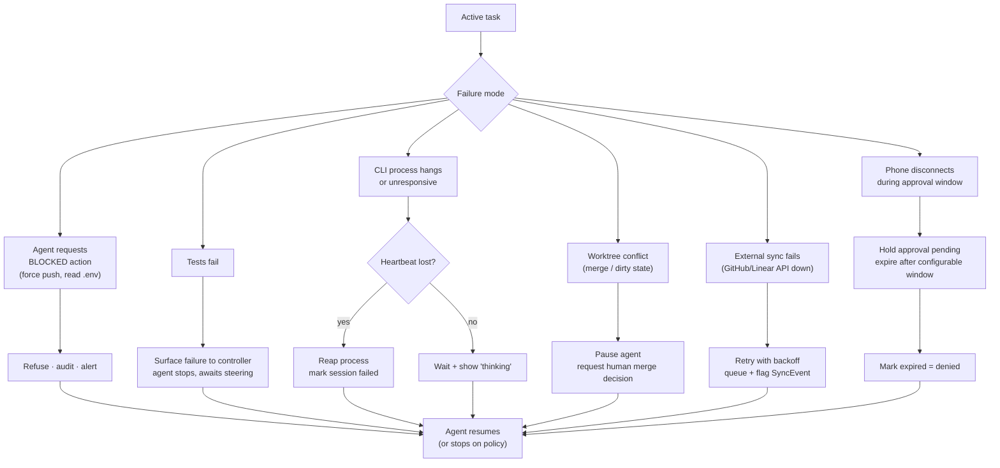
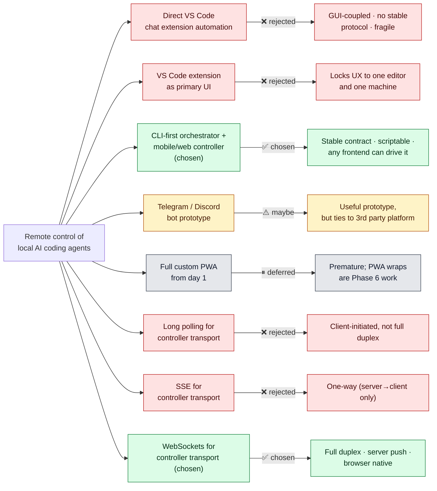

# System Diagrams

Source-of-truth diagrams for the project, authored as Mermaid so they render natively on GitHub and in Notion. Each one has a corresponding (planned) Figma version once the seat is upgraded.

---

## 1. System Architecture

Phone and orchestrator are bidirectional over WebSocket (live logs, approval prompts), with REST for one-shot commands. Each CLI agent runs inside WSL2, scoped to its own worktree.

---

## 2. Task Lifecycle Flow

---

## 3. Approval Gate State Machine

Expired approvals are **denials**, never auto-allows. See [`SAFETY.md`](SAFETY.md#failure-modes-worth-naming).

---

## 4. Database ERD

---

## 5. Happy Path

---

## 6. Bad Paths

Default behavior across all bad paths: **fail safe, log everything, surface to the human**. Never silently continue past a failure.

---

## 7. Alternatives Considered

---

## Notes for the Figma upgrade

When the Figma seat upgrades to editor:

1. Run `figma:figma-generate-diagram` against the Mermaid above for diagrams 1-6.
2. Diagram 7 (Alternatives Considered) is better as a hand-laid FigJam canvas with rich annotations than as a generated diagram.
3. The diagrams here remain canonical. Figma versions are *companions* — the source of truth lives in version control alongside the code.
