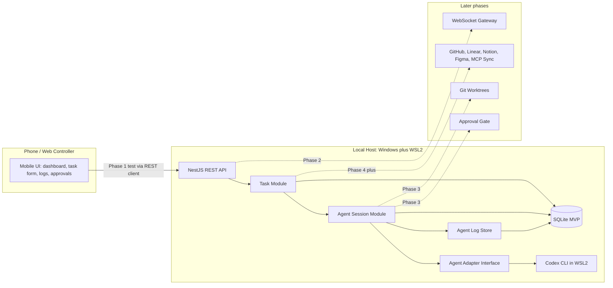
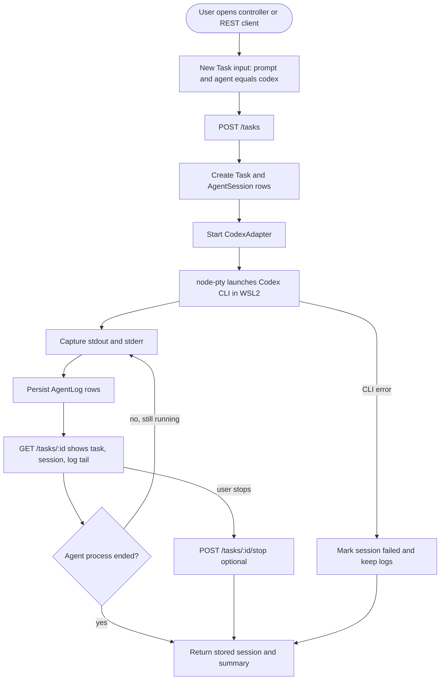
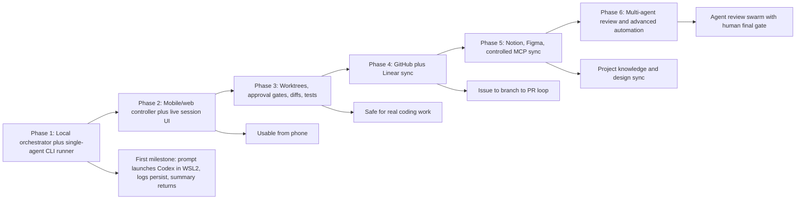
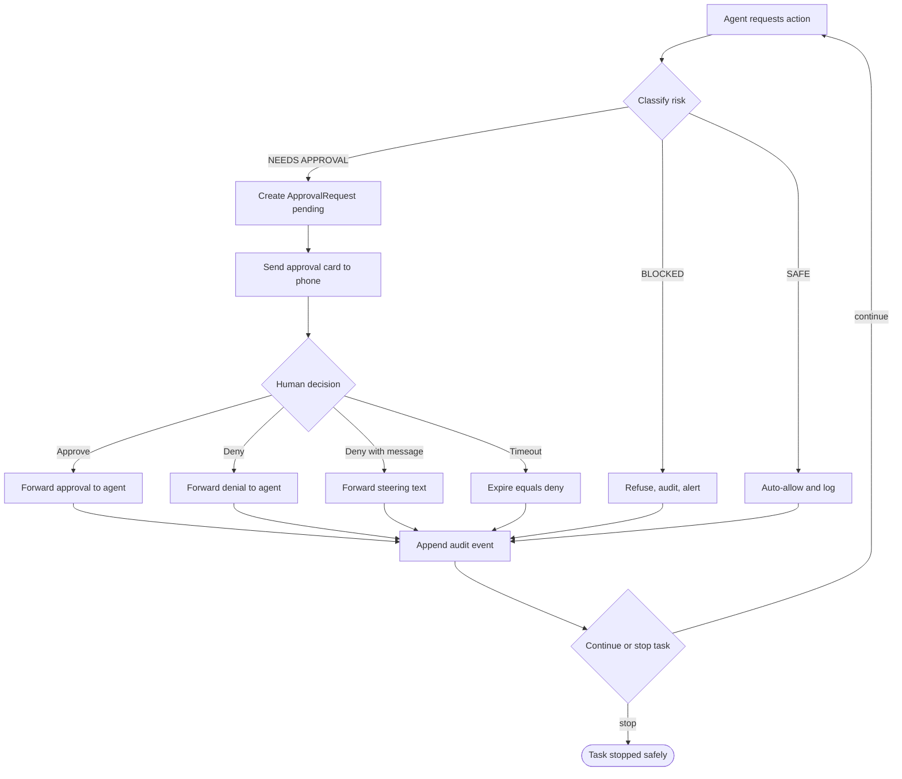

# Figma Companion Diagrams

These diagrams mirror the FigJam companion boards created for the project. The canonical architecture diagrams still live in [`docs/diagrams.md`](./diagrams.md); this file preserves the Figma companion set as version-controlled Mermaid so the repository remains the source of truth.

## FigJam Boards

- [ARC System Architecture](https://www.figma.com/board/UvKfcrygoArngHuPJOFH7z?utm_source=chatgpt&utm_content=edit_in_figjam&oai_id=v1%2Ftz6jqBBL9G8gridydDslE8NPS8QSNMmS7Z2yK53WgDre51jArgu3Ma&request_id=6190b3af-bd4c-4244-9e3c-d8c50fe0b1cb)
- [ARC Phase 1 UX Task Flow](https://www.figma.com/board/glUcIHkltNz5A0xd2qkmW4?utm_source=chatgpt&utm_content=edit_in_figjam&oai_id=v1%2Ftz6jqBBL9G8gridydDslE8NPS8QSNMmS7Z2yK53WgDre51jArgu3Ma&request_id=846303bd-6df7-4bb6-9595-35cff173dcda)
- [ARC Implementation Phases](https://www.figma.com/board/nRqdCuFj2xtaJLXyBRvLK7?utm_source=chatgpt&utm_content=edit_in_figjam&oai_id=v1%2Ftz6jqBBL9G8gridydDslE8NPS8QSNMmS7Z2yK53WgDre51jArgu3Ma&request_id=fa2b8b0a-c61f-4a79-bdda-86bdf13916f3)
- [ARC Approval and Bad Paths](https://www.figma.com/board/SbFjimirwqbxSEmjnArRcD?utm_source=chatgpt&utm_content=edit_in_figjam&oai_id=v1%2Ftz6jqBBL9G8gridydDslE8NPS8QSNMmS7Z2yK53WgDre51jArgu3Ma&request_id=a68f41bb-b6b0-4e01-8030-5a7c998f007a)

---

## 1. ARC System Architecture

---

## 2. ARC Phase 1 UX Task Flow

---

## 3. ARC Implementation Phases

---

## 4. ARC Approval and Bad Paths

