# Phase 4 Implementation Handoff

## Status

Phase 4 is the active planning and implementation frontier.

Completed foundation:

- Phase 1: local orchestrator + Codex CLI runner.
- Phase 2: mobile/web controller + live session UI.
- Phase 3: worktree isolation, approval gates, diffs, and test execution.
- Phase 3.5: durable replay, mobile reconnect, checkpoints, dormant sessions, provider-ready seams, and repo hygiene.

Phase 4 parent:

- Linear: [TSH-80](https://linear.app/michaelshuff/issue/TSH-80)
- GitHub: [Issue #5](https://github.com/mjshuff23/agents-with-remote-control-mobile-controller/issues/5)
- FigJam: [ARC Phase 4 Issue-to-PR Sync Flow](https://www.figma.com/board/1MVpD1gXJn2n5ieymjh8pO?utm_source=chatgpt&utm_content=edit_in_figjam&oai_id=v1%2FFRc5v8Q4bl79msDtKjy0fZTrxcbgb5qvXuCNpH47QLA1wB9TPLnl7Z&request_id=51a668d6-0e7d-4c3d-a2be-a80c604a09ae)

## Goal

Connect the local agent loop to GitHub and Linear so an agent task can move through:

```text
issue -> linked task -> isolated worktree -> branch -> approved commit -> approved push -> draft PR -> Linear status/link sync
```

The phone remains the human approval surface. Phase 4 does not auto-merge, auto-deploy, or bypass Phase 3 approval gates.

## Phase 4 flow diagram

This Mermaid diagram mirrors the FigJam Phase 4 sync flow so agents can reason from the repo-native source without needing to open Figma.

```mermaid
flowchart LR
  A["GitHub or Linear Issue"] --> B["Issue Picker on Mobile Controller"]
  B --> C["Linked Task Created"]
  C --> D["Provider Adapter Seams"]
  D --> E["SyncEvent Idempotency Record"]
  E --> F["Isolated Worktree and Safe Branch"]
  F --> G["Agent Work + Diff/Test Summary"]
  G --> H{"Human Approval"}
  H -->|"Approve Commit"| I["Create Local Commit"]
  I --> J{"Human Approval"}
  J -->|"Approve Push"| K["Push Branch"]
  K --> L{"Human Approval"}
  L -->|"Approve Draft PR"| M["Open Draft PR"]
  M --> N["Attach PR URL to Linear Issue"]
  N --> O["PR Merge Detection"]
  O --> P["Linear Completion Sync"]
  H -->|"Deny"| Q["Audit Denial"]
  J -->|"Deny"| Q
  L -->|"Deny"| Q
  Q --> R["Task Remains Reviewable"]
  E --> S["Retry Without Duplicates"]
  S --> E
  M --> T["Mobile Sync UI + Provider Errors"]
  P --> T
  T --> U["Durable Replay Preserves State"]

  classDef active fill:#EDE9FE,stroke:#6D28D9,color:#2e1065
  classDef gate fill:#FEF3C7,stroke:#92400E,color:#451a03
  classDef danger fill:#FEE2E2,stroke:#991B1B,color:#450a0a

  class A,B,C,D,E,F,G,I,K,M,N,O,P,T,U active
  class H,J,L gate
  class Q,R danger
  class S active
```



## Phase 4 child tickets

| Linear | Focus | Area |
|---|---|---|
| [TSH-97](https://linear.app/michaelshuff/issue/TSH-97) | GitHub access model for issue-to-PR workflow | Backend / Integration |
| [TSH-98](https://linear.app/michaelshuff/issue/TSH-98) | Linear access model and status mapping | Backend / Integration |
| [TSH-99](https://linear.app/michaelshuff/issue/TSH-99) | SyncEvent idempotency model | Backend / Integration |
| [TSH-100](https://linear.app/michaelshuff/issue/TSH-100) | Issue picker and task-linking UX | Frontend |
| [TSH-101](https://linear.app/michaelshuff/issue/TSH-101) | Branch naming and worktree lifecycle rules | Backend |
| [TSH-102](https://linear.app/michaelshuff/issue/TSH-102) | Approved commit flow and signing checks | Backend |
| [TSH-103](https://linear.app/michaelshuff/issue/TSH-103) | Approved push flow with remote protection | Backend |
| [TSH-104](https://linear.app/michaelshuff/issue/TSH-104) | Draft PR creation with generated summary | Backend |
| [TSH-105](https://linear.app/michaelshuff/issue/TSH-105) | Linear-GitHub cross-reference sync | Backend |
| [TSH-106](https://linear.app/michaelshuff/issue/TSH-106) | PR merge detection and Linear completion sync | Backend |
| [TSH-107](https://linear.app/michaelshuff/issue/TSH-107) | Provider adapter seams for GitHub and Linear | Backend / Architecture |
| [TSH-108](https://linear.app/michaelshuff/issue/TSH-108) | Approvals, audit logs, and sync events integration | Backend / Architecture |
| [TSH-109](https://linear.app/michaelshuff/issue/TSH-109) | Mobile sync UI and provider error surfaces | Frontend |
| [TSH-110](https://linear.app/michaelshuff/issue/TSH-110) | Provider adapter test matrix and token-gated e2e | Testing |

## Recommended implementation order

1. TSH-107 — adapter seams first, so provider work has clean boundaries.
2. TSH-99 — SyncEvent idempotency spine.
3. TSH-97 and TSH-98 — GitHub/Linear access models and config docs.
4. TSH-100 — issue picker and linked task creation UX/API.
5. TSH-101 — issue-linked branch and worktree rules.
6. TSH-108 — approval/audit/sync relationship matrix.
7. TSH-102 — approved commit flow.
8. TSH-103 — approved push flow.
9. TSH-104 — draft PR creation.
10. TSH-105 — Linear-GitHub cross-reference sync.
11. TSH-106 — PR merge detection and Linear completion sync.
12. TSH-109 — polish mobile sync UI and provider errors.
13. TSH-110 — complete test matrix and optional real-provider e2e tier.

## Non-negotiable constraints

- No auto-merge.
- No auto-deploy.
- No force-push.
- No external write without explicit approval unless a prior approval clearly covers the exact action.
- No provider SDK calls directly inside React components.
- No duplicate PRs, comments, links, or status updates on retry.
- No sensitive provider config in logs, DB metadata, or controller payloads.

## Provider seams

Provider clients should be thin wrappers around external APIs. Orchestration belongs in application services that compose:

- `Task`
- `AgentSession`
- `ApprovalRequest`
- `AuditLog`
- `SyncEvent`
- `GitHubProvider`
- `LinearProvider`

Suggested provider interfaces:

```ts
type ProviderActionResult = {
  provider: 'github' | 'linear';
  externalId?: string;
  url?: string;
  status: 'succeeded' | 'failed' | 'retryable' | 'skipped';
  errorCategory?: string;
};
```

## SyncEvent rules

Every provider-facing action gets a durable `SyncEvent` record keyed by one logical action. Retries must reuse or transition the existing event instead of creating duplicates.

Suggested states:

```text
pending -> running -> succeeded
pending -> running -> retryable -> running
pending -> skipped
running -> failed
```

Store only recovery-safe metadata: provider IDs, URLs, timestamps, action categories, and failure categories.

## Controller UX rules

The mobile controller should show enough detail to approve safely, then deep-link to GitHub/Linear for full context.

New Phase 4 UI surfaces:

- issue picker,
- linked task detail,
- sync status panel,
- commit approval card,
- push approval card,
- draft PR approval card,
- Linear status sync card,
- provider error display.

Existing Phase 3.5 replay semantics must remain intact. Reconnect/replay must not duplicate approval cards, sync cards, or event rows.

## Testing policy

Default tests must run without real external provider access. Real GitHub/Linear tests are optional and should auto-skip unless explicit provider config is present.

Test layers:

- unit tests with mocked providers,
- integration tests for issue-to-PR happy path with fixtures,
- token-gated real-provider e2e tests,
- replay/deduplication tests for mobile sync state.
