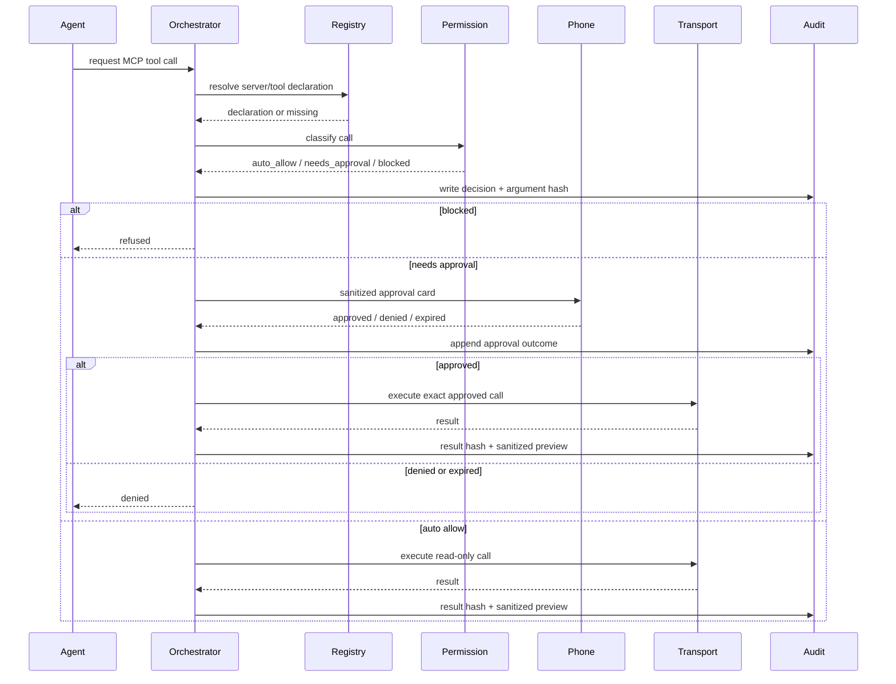

# Phase 5 Implementation Blueprint

## Status

Phase 5 is active. Phase 4.5 / Tailscale remote access is complete and is now the default private approval path for phone-based review outside the home LAN.

TSH-112 is complete. The MCP registry spine (`src/mcp/`) is implemented: typed schema, Phase-5 security validation, mtime-cached config loader, and unit + integration test coverage. The registry accepts `arc.mcp.json` (configurable via `ARC_MCP_REGISTRY_PATH`) and starts without MCP if the file is absent.

TSH-113 is complete. The MCP transport boundary is implemented in `src/mcp/transport/` with SDK-backed stdio, Streamable HTTP, and legacy SSE clients. The transport layer supports connection and `listTools` handshakes only; direct `callTool` execution remains blocked until the permission, approval, and audit layers land in later Phase 5 tickets.

Parent issue:

- Linear: [TSH-81](https://linear.app/michaelshuff/issue/TSH-81)
- GitHub: [Issue #6](https://github.com/mjshuff23/agents-with-remote-control-mobile-controller/issues/6)
- Remote access baseline: [TSH-111](https://linear.app/michaelshuff/issue/TSH-111), complete

## Goal

Add project knowledge and design synchronization after the core GitHub/Linear development loop is stable. MCP becomes a controlled tool layer with explicit permissions, not a god-mode escape hatch.

Phase 5 adds:

- Notion strategy doc sync for append-only session summaries.
- Figma/FigJam architecture link attachment and read-only metadata lookup.
- MCP server registry with declared capabilities and per-server permission ceilings.
- Read-only MCP behavior by default.
- Explicit mobile approval for append/write-capable MCP calls.
- Audit trail for every MCP invocation attempt.

## Non-negotiables

Every Phase 5 implementation PR must preserve these constraints:

- TDD first: write failing tests before implementation.
- Latest patch dependencies only on implementation day.
- Zero known vulnerabilities after install/update.
- `pnpm typecheck` passes.
- `pnpm test` passes.
- `pnpm test:e2e` passes.
- `pnpm lint:md` passes for docs changes.
- `pnpm --filter controller typecheck` passes when controller code changes.
- `pnpm --filter controller build` passes when controller code changes.
- No provider/MCP secret can be exposed to controller payloads, logs, DB rows, or PR examples.
- No MCP server can read secrets in Phase 5.
- No MCP server can auto-elevate above its registry-declared permission ceiling.
- No destructive or admin MCP behavior is allowed in Phase 5.

## Implementation order

| Order | Linear | Focus | Why first/next |
| --- | --- | --- | --- |
| 1 | [TSH-112](https://linear.app/michaelshuff/issue/TSH-112) | MCP registry schema/config loader | Establishes the controlled inventory and permission ceiling. |
| 2 | [TSH-113](https://linear.app/michaelshuff/issue/TSH-113) | MCP transports | Complete: adds stdio, Streamable HTTP, and legacy SSE boundaries without execution bypass. |
| 3 | [TSH-114](https://linear.app/michaelshuff/issue/TSH-114) | Permission ladder | Creates the policy choke point before write flows exist. |
| 4 | [TSH-115](https://linear.app/michaelshuff/issue/TSH-115) | Mobile approval for MCP writes | Routes append/write calls through the phone approval surface. |
| 5 | [TSH-116](https://linear.app/michaelshuff/issue/TSH-116) | MCP audit log | Persists every MCP decision with argument/result hashes. |
| 6 | [TSH-117](https://linear.app/michaelshuff/issue/TSH-117) | Notion adapter | Adds append-only strategy doc sync behind approval/audit. |
| 7 | [TSH-118](https://linear.app/michaelshuff/issue/TSH-118) | Figma/FigJam adapter | Adds read-only metadata and link attachment. |
| 8 | [TSH-119](https://linear.app/michaelshuff/issue/TSH-119) | Controller surfaces | Shows MCP/provider state without exposing secrets. |
| 9 | [TSH-120](https://linear.app/michaelshuff/issue/TSH-120) | Test matrix/docs/PR contract | Keeps future implementation agents constrained and reviewable. |

## Proposed backend module map

```text
src/
├── mcp/
│   ├── mcp.module.ts
│   ├── registry/
│   │   ├── mcp-registry.config.ts
│   │   ├── mcp-registry.schema.ts
│   │   └── mcp-registry.service.ts
│   ├── transport/
│   │   ├── mcp-transport.types.ts
│   │   ├── mcp-transport.factory.ts
│   │   ├── stdio-mcp-transport.ts
│   │   ├── streamable-http-mcp-transport.ts
│   │   └── legacy-sse-mcp-transport.ts
│   ├── permissions/
│   │   ├── mcp-permission.types.ts
│   │   ├── mcp-permission.policy.ts
│   │   └── mcp-permission.service.ts
│   ├── execution/
│   │   ├── mcp-tool-call.service.ts
│   │   └── mcp-approval.mapper.ts
│   └── audit/
│       ├── mcp-audit.types.ts
│       └── mcp-audit.service.ts
└── providers/
    ├── notion/
    │   ├── notion-provider.interface.ts
    │   ├── notion-client.ts
    │   ├── notion-summary.formatter.ts
    │   └── notion-sync.service.ts
    └── figma/
        ├── figma-provider.interface.ts
        ├── figma-client.ts
        ├── figma-url.parser.ts
        └── figma-link.service.ts
```

The exact file names can change, but the boundaries should not. Registry, transport, permission, execution, audit, and provider adapters must remain separate.

## MCP registry contract

The registry defines what the orchestrator is allowed to believe about a server. Runtime discovery may narrow behavior, but it must never increase authority.

```ts
export type McpTransportKind = 'stdio' | 'streamable_http' | 'legacy_sse';
export type McpPermissionLevel = 'read_only' | 'append_only' | 'write' | 'admin';
export type McpToolRisk = 'read' | 'append' | 'write' | 'destructive' | 'secret_sensitive';

export type McpTransportDeclaration =
  | {
      kind: 'stdio';
      command: string;
      args?: string[];
      cwd?: string;
      envAllowlist?: string[];
    }
  | {
      kind: 'streamable_http';
      url: string;
      headersEnvAllowlist?: string[];
    }
  | {
      kind: 'legacy_sse';
      url: string;
      headersEnvAllowlist?: string[];
    };

export interface McpToolDeclaration {
  name: string;
  description?: string;
  risk: McpToolRisk;
  requiresApproval: boolean;
  allowedArgumentPaths?: string[];
  blockedArgumentPaths?: string[];
}

export interface McpServerRegistration {
  id: string;
  displayName: string;
  enabled: boolean;
  transport: McpTransportDeclaration;
  permissionLevel: McpPermissionLevel;
  tools: McpToolDeclaration[];
  canReadSecrets: false;
  createdBy: 'config' | 'runtime';
}
```

Validation rules:

- Missing permission fails closed.
- Unknown permission fails closed.
- Duplicate tools fail config load.
- `canReadSecrets: true` is invalid in Phase 5.
- `admin` is reserved and blocked unless a future phase explicitly enables it.
- Runtime-discovered tools not present in the registry are blocked.
- Runtime-discovered capabilities can only reduce authority.

## MCP transport boundary

The transport layer lives in `src/mcp/transport/` and uses `@modelcontextprotocol/sdk@1.29.0`, the latest SDK patch checked on May 18, 2026.

Implemented files:

- `mcp-transport.types.ts` defines the common client interface, safe error categories, timeout helper, and SDK-backed base class.
- `mcp-transport.factory.ts` constructs transports from registry declarations and exports a Nest-injectable factory.
- `stdio-mcp-transport.ts` validates executable/args form, rejects shell interpolation paths, and passes only `envAllowlist` values.
- `streamable-http-mcp-transport.ts` validates `http`/`https` URLs and passes only `headersEnvAllowlist` values as request headers.
- `legacy-sse-mcp-transport.ts` keeps old SSE servers behind the same safe HTTP header and timeout behavior.

Supported operations:

- `connect`
- `listTools`
- `close`

Blocked until later tickets:

- `callTool`, which currently throws `execution_blocked`.
- Permission classification for tool execution.
- Mobile approval cards for append/write calls.
- MCP audit persistence and argument/result hashing.

Streamable HTTP remains the preferred HTTP path. Legacy SSE exists only for older MCP servers that have not adopted Streamable HTTP.

## Permission ladder

| Server permission | Tool risk allowed | Default behavior |
| --- | --- | --- |
| `read_only` | `read` only | Auto-allow with audit. |
| `append_only` | `read`, `append` | Read auto-allow; append requires approval. |
| `write` | `read`, `append`, `write` | Read auto-allow; append/write require approval. |
| `admin` | Reserved | Blocked in Phase 5. |

Always blocked in Phase 5:

- `destructive`
- `secret_sensitive`
- undeclared tools
- tools above the server permission ceiling
- raw secret access
- delete/replace behavior in Notion
- Figma writes
- MCP calls with raw headers/env values in user-visible payloads

## Approval flow



## MCP audit fields

Minimum audit fields:

- `id`
- `taskId`
- `sessionId`
- `approvalRequestId`, nullable
- `serverId`
- `serverDisplayName`
- `toolName`
- `permissionLevel`
- `toolRisk`
- `decision`: `auto_allow | approved | denied | expired | blocked | failed`
- `decider`: `system | user | policy`
- `reasonCode`
- `argumentHash`
- `resultHash`, nullable
- `sanitizedArgumentPreview`
- `sanitizedResultPreview`, nullable
- `startedAt`
- `finishedAt`, nullable
- `errorCategory`, nullable

Use Node `crypto` for hashing unless a stronger reason exists. Store normalized hashes of raw arguments/results, but only sanitized and bounded previews.

## Notion adapter rules

Notion sync is append-only in Phase 5.

Allowed:

- Read configured project doc metadata.
- Append a bounded session summary under a known sync section.
- Include task ID, Linear/GitHub references, PR link, tests run, approval outcomes, and concerns.

Not allowed:

- Replace entire page content.
- Delete or move child blocks.
- Delete or overwrite existing summaries.
- Expose Notion token or raw private page body to controller/browser logs.

Required idempotency:

- A completed task summary must append once per task/session/result tuple.
- Retry should reuse existing sync/audit event state and avoid duplicate blocks.

## Figma/FigJam adapter rules

Figma/FigJam support is read-only metadata and link attachment in Phase 5.

Allowed:

- Parse Figma/FigJam URLs.
- Fetch safe metadata for configured/approved links.
- Attach URLs to local task context and supported external issue surfaces.

Not allowed:

- Figma file writes.
- Broad file content dumping into controller payloads.
- Token exposure.
- Duplicate link spam on retry.

## Testing matrix

| Layer | Required coverage |
| --- | --- |
| Unit | Registry validation, transport factory, permission decisions, redaction, hashing, URL parsers, summary formatters. |
| Integration | Config loading, mocked MCP handshakes, approval flow, audit persistence, Notion append mock, Figma metadata mock, retry/idempotency. |
| E2E | Task lifecycle with MCP approval card, replay without duplicates, denied/expired write call behavior. |
| Token-gated E2E | Optional Notion/Figma real-provider checks; must auto-skip without explicit config. |
| Controller | Safe registry/audit rendering, MCP approval card rendering, no secret-like payloads. |

## Required PR structure

Every Phase 5 PR must include:

- Summary and motivation.
- Linked Linear issue.
- Exact files added/changed.
- Architecture boundary affected.
- TDD proof: tests written first or a clear explanation when impossible.
- Commands run and results.
- Dependency additions/updates with exact versions.
- `pnpm audit --audit-level=low` result.
- Critical areas for AI and human review.
- Reproducibility steps.
- Security concerns and deferred risks.

## Validation command set

Run the full set unless the PR scope makes a command impossible. If skipped, explain why in the PR.

```bash
pnpm install
pnpm audit --audit-level=low
pnpm typecheck
pnpm test
pnpm test:e2e
pnpm lint:md
pnpm --filter controller typecheck
pnpm --filter controller build
```

## Documentation links

- MCP controlled sync details: [`mcp-controlled-sync.md`](mcp-controlled-sync.md)
- Official source snapshot: [`phase-5-official-sources.md`](phase-5-official-sources.md)
- Safety model: [`SAFETY.md`](SAFETY.md)
- Remote access baseline: [`remote-access.md`](remote-access.md)
